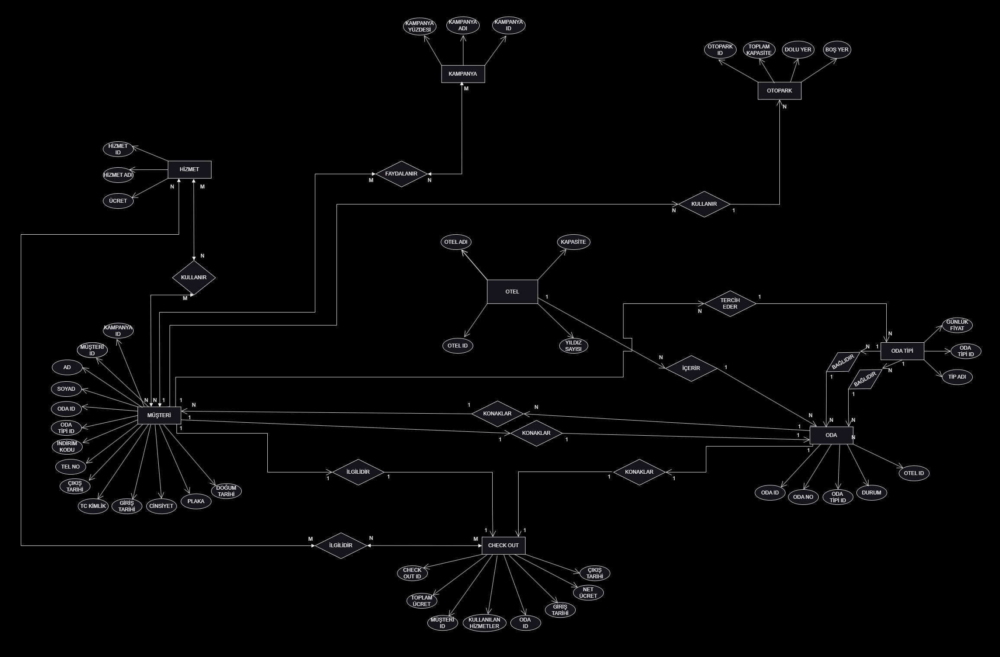

# BMÜ329 VERİ TABANI SİSTEMLERİ DERSİ DÖNEM PROJESİ

## Proje Adı: Otel Otomasyon Sistemi

### Proje Ekibi
* Aleyna YILMAZ
* Ömer Murat KARACA
* Ahmet El RECEP

### Proje Gereksinimleri
Otel Otomasyon Sistemi veri tabanı projesinin gereksinim detaylarını alt kısımda açıkladık. Projemizde yer alan varlıklar, bu varlıkların sahip olduğu nitelikler ve aralarındaki ilişkiler belirtilmiştir.

### Müşteri Gereksinimleri
Müşteri, oda tipine göre rezervasyon yapabilir. Belirlenmiş hizmetlerden faydalanabilir (havuz vb.) Müşteri, konaklama ve hizmet dökümü olan Check Out'u görüntüleyebilir. Müşteri, kendisine sunulmuş kampanyalardan yararlanabilir. Müşteri, araç plaka bilgisiyle otopark hizmetinden yararlanabilir.

### Varlıklar ve İlişkiler

#### 1. Otel Tablosu
**Özellikler:**
* OtelID (PK): Otel kimlik numarası
* OtelAdi: Otel ismi
* Kapasite: Toplam oda kapasitesi
* YildizSayisi: Otel yıldız sayısı

**İlişkiler:**
* Sahip Olur (Oda): Bir otel birden fazla odaya sahiptir (1:N)

#### 2. Oda Tipi Tablosu
**Özellikler:**
* OdaTipiID (PK): Oda kimlik numarası
* TipAdi: Odanın kategorisi
* GunlukFiyat: Odanın bir günlük fiyatı

**İlişkiler:**
* Bağlıdır (Oda): Bir OdaTipi birden fazla odayı temsil edebilir (1:N)

#### 3. Oda Tablosu
**Özellikler:**
* OdaID (PK): Oda kimlik numarası
* OdaNo: Oda numarası
* OdaTipiID (FK): Oda türünün kimlik numarası
* Durum: Odanın doluluk durumu
* OtelID (FK): Bağlı olduğu otel

**İlişkiler:**
* Ait Olur (Otel): Her oda bir otele aittir (N:1)
* Sahip Olur (OdaTipi): Her oda bir tipe sahiptir (N:1)
* Konaklama (Müşteri): Bir odada birden fazla müşteri kalabilir (1:N)

#### 4. Müşteri Tablosu
**Özellikler:**
* MusteriID (PK): Müşteri kimlik numarası
* Ad: Müşteri adı
* Soyad: Müşteri soyadı
* DogumTarihi: Doğum tarihi
* Cinsiyet: Cinsiyet bilgisi
* TCKimlikNo: TC kimlik numarası
* TelefonNo: İletişim numarası
* Plaka: Araç plakası
* GirisTarihi: Müşterinin otele giriş tarihi
* CikisTarihi: Müşterinin otelden ayrılma tarihi
* OdaID: Müşterinin kaldığı odanın kimlik numarası
* OdaTipiID: Müşterinin kaldığı odanın türünün kimlik numarası
* KampanyaID: Müşteriye tanınan indirim kodunun kimlik numarası

**İlişkiler:**
* Konaklama (Oda): Müşteri bir odada konaklayabilir (N:1)
* Kullanır (Hizmet): Müşteri birden fazla hizmet kullanabilir (N:M)
* Yararlanır (Kampanya): Müşteri kampanyalardan yararlanabilir (N:M)
* Kullanır (Otopark): Müşteri otopark hizmetinden yararlanabilir (N:1)

#### 5. Hizmet Tablosu
**Özellikler:**
* HizmetID (PK): Hizmet kimlik numarası
* HizmetAdi: Hizmet adı
* Ucret: Hizmet ücreti

**İlişkiler:**
* Kullanılır (Müşteri): Bir hizmet birden fazla müşteri tarafından kullanılabilir (M:N)

#### 6. Kampanya Tablosu
**Özellikler:**
* KampanyaID (PK): Kampanya kimlik numarası
* KampanyaAdi: Kampanya adı
* IndirimYuzdesi: İndirim oranı

**İlişkiler:**
* Yararlanılır (Müşteri): Bir kampanyadan birden fazla müşteri yararlanabilir (M:N)

#### 7. Otopark Tablosu
**Özellikler:**
* OtoparkID (PK): Otoparkın kimlik numarası
* ToplamKapasite: Otoparka toplam girebilecek araç sayısı
* DoluYer: Otoparkta bulunan araç sayısı
* BosYer: Otoparkın anlık boş yer sayısı

**İlişkiler:**
* Yararlanılır (Müşteri): Otoparktan birden fazla müşteri yararlanabilir (M:N)

### İlişki Özeti

| İlişki | Varlık 1 | Varlık 2 | Kardinalite |
|--------|-----------|-----------|-------------|
| Sahip Olur | Otel | Oda | 1:N |
| Bağlıdır | OdaTipi | Oda | 1:N |
| Ait Olur | Oda | Otel | N:1 |
| Sahip Olur | Oda | OdaTipi | N:1 |
| Konaklama | Oda | Müşteri | 1:N |
| Konaklama | Müşteri | Oda | N:1 |
| Kullanır | Müşteri | Hizmet | M:N |
| Kullanılır | Hizmet | Müşteri | M:N |
| Yararlanır | Müşteri | Kampanya | M:N |
| Yararlanılır | Kampanya | Müşteri | M:N |
| Kullanır | Müşteri | Otopark | N:1 |
| Yararlanılır | Otopark | Müşteri | 1:N |

### E-R DİYAGRAMI

